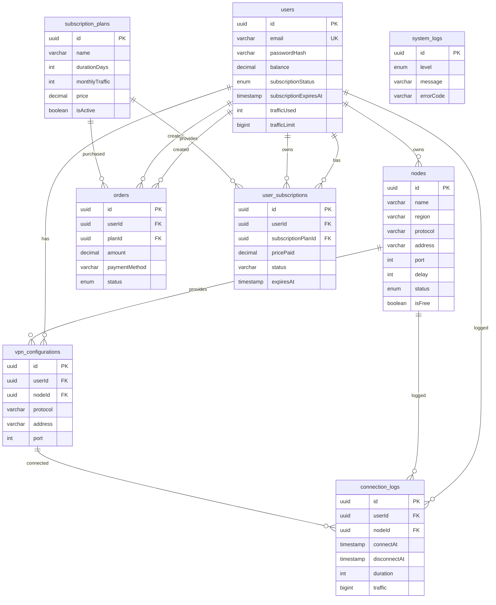

# VPN 服务数据模型

## 项目信息

- **框架**: NestJS + TypeORM
- **数据库**: PostgreSQL 14
- **容器**: Docker 运行中
- **连接配置**:
  - 主机: localhost
  - 端口: 5432
  - 数据库: vpn_db
  - 用户: admin
  - 密码: admin1234

## 数据库表结构 (8张表)

### 1. users - 用户表

| 字段名 | 类型 | 约束 | 说明 |
|--------|------|------|------|
| id | UUID | PRIMARY KEY | 用户唯一标识 |
| email | varchar(255) | NOT NULL, UNIQUE | 用户邮箱（唯一索引） |
| passwordHash | varchar(255) | NOT NULL | 密码哈希值 |
| balance | numeric(10,2) | NOT NULL | 用户余额 |
| subscriptionStatus | enum | NOT NULL | 订阅状态枚举 |
| subscriptionPlanId | varchar(255) | 可空 | 外键：订阅计划ID |
| subscriptionExpiresAt | timestamp with time zone | 可空 | 订阅过期时间 |
| trafficUsed | integer | NOT NULL | 已使用流量 |
| trafficLimit | bigint | NOT NULL | 流量限额 |
| created_at | timestamp with time zone | NOT NULL | 创建时间 |
| updated_at | timestamp with time zone | NOT NULL | 更新时间 |

**索引**:
- PRIMARY KEY: id
- UNIQUE: email
- INDEX: (subscriptionStatus, subscriptionExpiresAt)

**外键引用**:
- users → orders (userId)
- users → user_subscriptions (userId)
- users → connection_logs (userId)
- users → vpn_configurations (userId)
- users → nodes (userId)

---

### 2. nodes - 节点表

| 字段名 | 类型 | 约束 | 说明 |
|--------|------|------|------|
| id | UUID | PRIMARY KEY | 节点唯一标识 |
| name | varchar | NOT NULL | 节点名称 |
| region | varchar | NOT NULL | 节点地区 |
| protocol | varchar | NOT NULL | 协议类型 |
| address | varchar | NOT NULL | 节点地址 |
| port | integer | NOT NULL | 端口号 |
| path | varchar | 可空 | 路径 |
| serverName | varchar | 可空 | 服务器名称 |
| delay | integer | NOT NULL | 延迟（毫秒） |
| status | enum | NOT NULL | 状态枚举 |
| isFree | boolean | NOT NULL | 是否免费 |
| userId | UUID | 可空 | 外键：管理员ID |
| created_at | timestamp without time zone | NOT NULL | 创建时间 |
| updated_at | timestamp without time zone | NOT NULL | 更新时间 |

**索引**:
- PRIMARY KEY: id
- INDEX: status
- INDEX: delay
- INDEX: region

**外键引用**:
- nodes → users (userId)
- nodes → vpn_configurations (nodeId)
- nodes → connection_logs (nodeId)

---

### 3. vpn_configurations - VPN配置表

| 字段名 | 类型 | 约束 | 说明 |
|--------|------|------|------|
| id | UUID | PRIMARY KEY | 配置唯一标识 |
| userId | UUID | NOT NULL, FOREIGN KEY | 用户ID |
| nodeId | UUID | NOT NULL, FOREIGN KEY | 节点ID |
| protocol | varchar | NOT NULL | 协议类型 |
| address | varchar | NOT NULL | 地址 |
| port | integer | NOT NULL | 端口 |
| path | varchar | NOT NULL | 路径 |
| serverName | varchar | NOT NULL | 服务器名称 |
| created_at | timestamp without time zone | NOT NULL | 创建时间 |
| updated_at | timestamp without time zone | NOT NULL | 更新时间 |

**索引**:
- PRIMARY KEY: id
- INDEX: nodeId
- INDEX: userId

**外键引用**:
- vpn_configurations → users (userId)
- vpn_configurations → nodes (nodeId)

---

### 4. orders - 订单表

| 字段名 | 类型 | 约束 | 说明 |
|--------|------|------|------|
| id | UUID | PRIMARY KEY | 订单唯一标识 |
| userId | UUID | NOT NULL, FOREIGN KEY | 用户ID |
| planId | UUID | NOT NULL, FOREIGN KEY | 订阅计划ID |
| amount | numeric(10,2) | NOT NULL | 订单金额 |
| paymentMethod | varchar | NOT NULL | 支付方式 |
| status | enum | NOT NULL | 订单状态枚举 |
| payUrl | varchar | 可空 | 支付链接 |
| paymentTransactionId | varchar | 可空 | 支付交易ID |
| paidAt | timestamp without time zone | 可空 | 支付时间 |
| created_at | timestamp without time zone | NOT NULL | 创建时间 |
| updated_at | timestamp without time zone | NOT NULL | 更新时间 |

**索引**:
- PRIMARY KEY: id

**外键引用**:
- orders → users (userId)
- orders → subscription_plans (planId)

---

### 5. subscription_plans - 订阅计划表

| 字段名 | 类型 | 约束 | 说明 |
|--------|------|------|------|
| id | UUID | PRIMARY KEY | 计划唯一标识 |
| name | varchar | NOT NULL | 计划名称 |
| durationDays | integer | NOT NULL | 有效天数 |
| monthlyTraffic | integer | NOT NULL | 月流量限额 |
| price | numeric(10,2) | NOT NULL | 价格 |
| isActive | boolean | NOT NULL | 是否激活 |
| displayOrder | integer | NOT NULL | 显示顺序 |
| created_at | timestamp without time zone | NOT NULL | 创建时间 |
| updated_at | timestamp without time zone | NOT NULL | 更新时间 |

**索引**:
- PRIMARY KEY: id

**外键引用**:
- subscription_plans → user_subscriptions (planId)
- subscription_plans → orders (planId)

---

### 6. user_subscriptions - 用户订阅表

| 字段名 | 类型 | 约束 | 说明 |
|--------|------|------|------|
| id | UUID | PRIMARY KEY | 订阅唯一标识 |
| userId | UUID | NOT NULL, FOREIGN KEY | 用户ID |
| subscriptionPlanId | UUID | NOT NULL, FOREIGN KEY | 订阅计划ID |
| pricePaid | numeric(10,2) | NOT NULL | 支付金额 |
| status | varchar | NOT NULL | 订阅状态 |
| expiresAt | timestamp without time zone | 可空 | 过期时间 |
| trafficUsed | bigint | NOT NULL | 已使用流量 |
| trafficLimit | bigint | NOT NULL | 流量限额 |
| created_at | timestamp without time zone | NOT NULL | 创建时间 |
| updated_at | timestamp without time zone | NOT NULL | 更新时间 |

**索引**:
- PRIMARY KEY: id
- INDEX: userId
- INDEX: subscriptionPlanId
- INDEX: expiresAt

**外键引用**:
- user_subscriptions → users (userId)
- user_subscriptions → subscription_plans (planId)

---

### 7. connection_logs - 连接日志表

| 字段名 | 类型 | 约束 | 说明 |
|--------|------|------|------|
| id | UUID | PRIMARY KEY | 日志唯一标识 |
| userId | UUID | NOT NULL, FOREIGN KEY | 用户ID |
| nodeId | UUID | NOT NULL, FOREIGN KEY | 节点ID |
| connectAt | timestamp without time zone | NOT NULL | 连接时间 |
| disconnectAt | timestamp without time zone | 可空 | 断开时间 |
| duration | integer | NOT NULL | 连接时长（秒） |
| traffic | bigint | NOT NULL | 传输流量 |
| status | enum | NOT NULL | 连接状态枚举 |
| created_at | timestamp without time zone | NOT NULL | 创建时间 |
| updated_at | timestamp without time zone | NOT NULL | 更新时间 |

**索引**:
- PRIMARY KEY: id
- INDEX: userId
- INDEX: nodeId

**外键引用**:
- connection_logs → users (userId)
- connection_logs → nodes (nodeId)

---

### 8. system_logs - 系统日志表

| 字段名 | 类型 | 约束 | 说明 |
|--------|------|------|------|
| id | UUID | PRIMARY KEY | 日志唯一标识 |
| level | enum | NOT NULL | 日志级别枚举 |
| message | varchar | NOT NULL | 日志消息 |
| errorCode | varchar | 可空 | 错误代码 |
| userId | varchar | 可空 | 用户ID |
| ipAddress | varchar | 可空 | IP地址 |
| created_at | timestamp without time zone | NOT NULL | 创建时间 |

**索引**:
- PRIMARY KEY: id

---

## 枚举类型

### 1. orders_status_enum - 订单状态枚举
| 值 | 说明 |
|----|------|
| PENDING | 待支付 |
| PAID | 已支付 |
| FAILED | 支付失败 |
| CANCELLED | 已取消 |

### 2. users_subscriptionstatus_enum - 用户订阅状态枚举
| 值 | 说明 |
|----|------|
| ACTIVE | 活跃 |
| EXPIRED | 已过期 |
| CANCELLED | 已取消 |

### 3. nodes_status_enum - 节点状态枚举
| 值 | 说明 |
|----|------|
| online | 在线 |
| offline | 离线 |

### 4. connection_logs_status_enum - 连接状态枚举
| 值 | 说明 |
|----|------|
| connected | 已连接 |
| disconnected | 已断开 |
| failed | 连接失败 |

### 5. system_logs_level_enum - 日志级别枚举
| 值 | 说明 |
|----|------|
| info | 信息 |
| warning | 警告 |
| error | 错误 |

---

## 数据模型关系图



---

## 关系说明

### 1:1 关系
- **users - vpn_configurations**: 一个用户可以有多个VPN配置（1:N）
- **users - nodes**: 一个用户可以拥有多个节点（1:N）

### 1:N 关系
- **users → orders**: 一个用户可以创建多个订单
- **users → user_subscriptions**: 一个用户可以订阅多个计划
- **users → connection_logs**: 一个用户的连接日志
- **nodes → vpn_configurations**: 一个节点可以为多个用户配置
- **nodes → connection_logs**: 一个节点的连接日志
- **vpn_configurations → connection_logs**: 一个配置的连接日志
- **subscription_plans → orders**: 一个订阅计划可以被多次购买
- **subscription_plans → user_subscriptions**: 一个订阅计划可以被多次订阅

### 多对多关系（通过中间表）
- **users ↔ subscription_plans**: 通过 user_subscriptions 表关联

---

## 设计特点

1. **UUID主键**: 所有表使用UUID作为主键，避免ID泄露和预测
2. **时间戳字段**: 所有表都有created_at和updated_at字段
3. **索引优化**: 关键字段都有索引优化查询性能
4. **枚举类型**: 使用枚举确保数据一致性
5. **流量追踪**: 通过trafficUsed和trafficLimit字段追踪用户流量使用情况
6. **订阅管理**: 通过subscriptionStatus和subscriptionExpiresAt管理订阅状态
7. **连接日志**: 记录VPN连接的详细信息和流量使用情况
8. **系统日志**: 记录系统运行状态和错误信息

---

## 数据库初始化

数据库已通过Docker容器运行，使用以下命令连接：

```bash
# 连接数据库
docker exec -it vpn-service-postgres-1 psql -U admin -d vpn_db

# 或使用psql客户端
psql -h localhost -p 5432 -U admin -d vpn_db
```

## 实体类文件位置

所有实体类位于 `backend/src/entities/` 目录下：

- user.entity.ts - 用户实体
- node.entity.ts - 节点实体
- vpn-config.entity.ts - VPN配置实体
- order.entity.ts - 订单实体
- subscription-plan.entity.ts - 订阅计划实体
- user-subscription.entity.ts - 用户订阅实体
- connection-log.entity.ts - 连接日志实体
- system-log.entity.ts - 系统日志实体